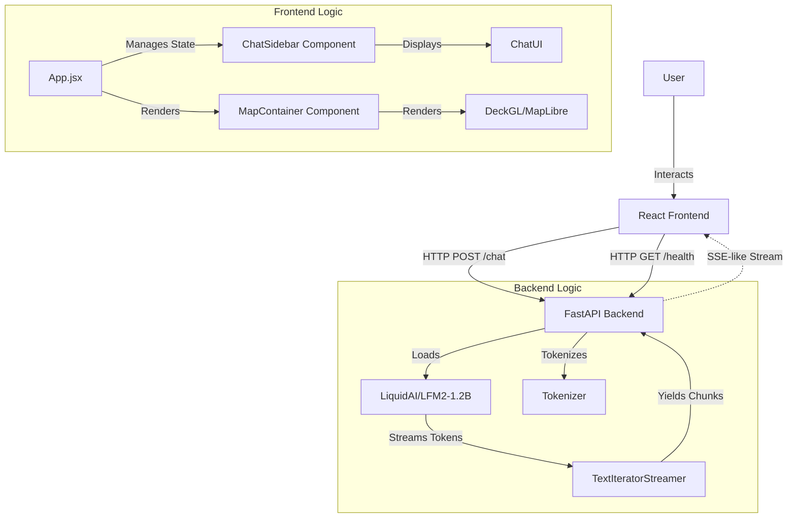

# Project Documentation: Interactive Walkability Dashboard

## 1. Project Overview
The **Interactive Walkability Dashboard** is a full-stack web application designed to demonstrate real-time interactions with a Large Language Model (LLM) alongside a geographical map visualization. The project aims to provide a platform where users can query information (via chat) and visualize spatial data (via map).

Currently, the application serves as a foundational demo featuring:
-   **Streaming Chat Interface**: Real-time conversation with the `LiquidAI/LFM2-1.2B` model.
-   **Interactive Map**: A MapLibre/Deck.gl map centered on New York City.
-   **Modern UI**: A responsive, dark-themed interface built with React and Vite.

## 2. Architecture Diagram

## 3. Technology Stack

### Frontend
-   **Framework**: [React](https://react.dev/) (v18+)
-   **Build Tool**: [Vite](https://vitejs.dev/)
-   **Language**: JavaScript (ES6+)
-   **Styling**: Vanilla CSS (CSS3 variables, flexbox)
-   **Map Libraries**:
    -   `deck.gl`: High-performance WebGL-based visualization layers.
    -   `react-map-gl`: React wrapper for MapLibre/Mapbox.
    -   `maplibre-gl`: Open-source fork of Mapbox GL JS for base maps.

### Backend
-   **Framework**: [FastAPI](https://fastapi.tiangolo.com/) (Python Asynchronous Web Framework)
-   **Server**: [Uvicorn](https://www.uvicorn.org/) (ASGI Server)
-   **Machine Learning**:
    -   `transformers` (Hugging Face): Model loading and generation.
    -   `torch` (PyTorch): Deep learning backend.
    -   `accelerate`: Efficient model loading and hardware utilization.
-   **Model**: [LiquidAI/LFM2-1.2B](https://huggingface.co/LiquidAI/LFM2-1.2B)
    -   Type: Causal Language Model
    -   Size: ~1.2 Billion Parameters
    -   Precision: `bfloat16`

## 4. Module Deep Dive

### 4.1. Frontend Modules

#### `App.jsx`
-   **Purpose**: The root component and state manager.
-   **Responsibilities**:
    -   Holds application state: `messages`, `input`, `loading`, `serverStatus`.
    -   Manages the WebSocket-like HTTP streaming connection to the backend.
    -   Polls the backend `/health` endpoint to update connectivity status.
    -   Orchestrates the layout between `ChatSidebar` and `MapContainer`.
-   **Tech**: React Hooks (`useState`, `useEffect`, `useRef`).

#### `components/ChatSidebar.jsx`
-   **Purpose**: Handles the user inputs and displays the conversation history.
-   **Inputs (Props)**:
    -   `messages`: Array of message objects `{ role, content, timeTaken, isStreaming }`.
    -   `onSendMessage`: Callback function when user submits a message.
    -   `serverStatus`: Boolean indicating backend health.
    -   `loading`: Boolean indicating if a request is in progress.
-   **Outputs**: Renders the chat UI pipeline.
-   **Key Features**:
    -   Auto-scroll to bottom.
    -   Visual "typing" cursor for streaming messages.
    -   Status dot (Green/Red) for server health.

#### `components/MapContainer.jsx`
-   **Purpose**: Renders the interactive geospatial view.
-   **Inputs**: None (currently self-contained, but extensible for `viewState` control).
-   **Outputs**: WebGL Canvas containing the map.
-   **Configuration**:
    -   **Center**: NYC (Lat: 40.7128, Lon: -74.0060).
    -   **Style**: Carto Positron (Public URL, API key free).
    -   **Library**: Uses `DeckGL` as the parent controller for overlay layers and `Map` (from `react-map-gl`) for the base tile rendering.

### 4.2. Backend Modules

#### `main.py`
-   **Purpose**: The entry point for the API server.
-   **Endpoints**:
    -   `POST /chat`: Accepting a JSON payload `{ "message": "..." }`. Returns a `StreamingResponse` of text chunks.
    -   `GET /health`: Returns `{ "status": "ok", "model_loaded": true }`.
-   **Model Logic**:
    -   **Lifespan Manager**: Loads the heavy LLM into GPU/CPU memory *once* on startup.
    -   **Generation**: Uses `model.generate()` in a separate thread.
    -   **Streaming**: Uses `TextIteratorStreamer` to intercept tokens as they are generated and `yield` them to the HTTP response immediately for a low-latency user experience.
    -   **Parameters**: `temperature=0.3` (focused), `max_new_tokens=512`.

## 5. Usage Guide
1.  **Start the System**: Run `dashboard/start_demo.bat`.
2.  **Wait for Load**: Watch the backend terminal for "Model loaded successfully".
3.  **Chat**: Type in the sidebar to test inference speed and quality.
4.  **Navigate**: Drag and zoom the map to explore the NYC area.
